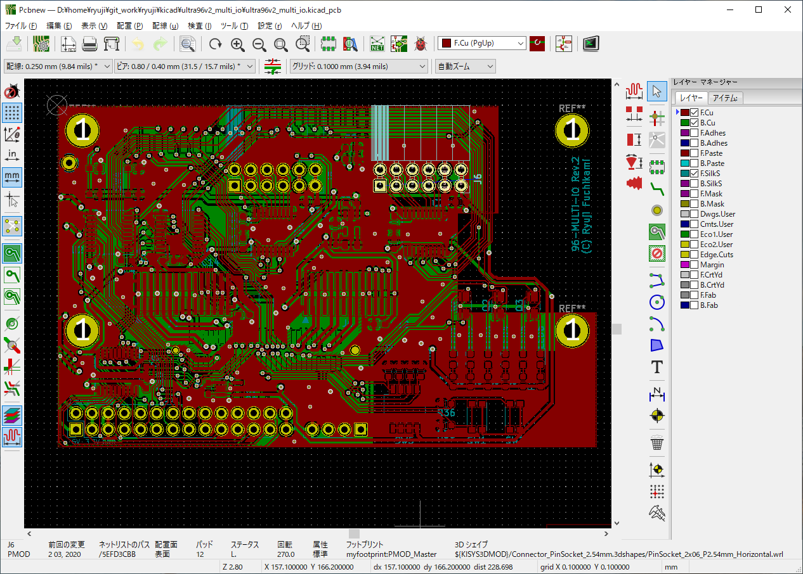

# Ultra96V2用マルチI/O拡張カード

現在デバッグ中ですが、MIPI-CSI の動作確認できました。

## 開発イメージ

下記のようなイメージで開発している [Ultra96V2](https://www.avnet.com/wps/portal/japan/products/product-highlights/ultra96/) 向けのI/O拡張ボードです。

 

## 設計コンセプト

コンセプトは

- [FusionPCB](https://www.fusionpcb.jp)さんの$4.9基板で作る
- [ZYBO](https://reference.digilentinc.com/reference/programmable-logic/zybo-z7/start) の良さ(PLのI/O機能の充実)の追加
- [Raspberry PI](https://ja.wikipedia.org/wiki/Raspberry_Pi) の良さ(PSのI/O機能の充実)の追加
- 使いたい機能だけ部品実装すれば最低限のコストで使える

です。

## 機能

主な機能として

- PLの機能
    - TXS0108で3.3V双方向変換した12pin PMOD × 2個
    - RaspberryPI互換 MIPI-CSIコネクタ× 2個
    - LED × 4個
    - プッシュスイッチ × 2個 
    - ディップスイッチ(4bit) × 1個 
    - 25MHzクロック供給
- PSの機能
    - LED × 2個
    - TXS0108で3.3V双方向変換したGPIO
    - TXS0108で3.3V双方向変換したI2C
    - TXS0108で3.3V双方向変換したSPI
- その他の機能
    - 隠れると困るPWR/RSTスイッチの引き出し
    - 申し訳程度にUSB2.0信号を引き出したピンヘッダ

特に MIPI-CSI は、[こちら](http://nahitafu.cocolog-nifty.com/nahitafu/2008/11/post-57a1.html)を参考にさせて頂いて、基板厚 0.6mm の想定で設計時の机上計算のみ行っています)。

## 回路図

回路図は[こちら](documents/ultra96v2_multi_io_schematic.pdf)

## 追加情報

こちらに[ブログ記事](https://ryuz.hatenablog.com/entry/2020/07/26/215500)を書きました。

## 修正履歴

- Rev.1 2020/02/11
   - 修正内容
       - 初版
   - 動作状況
       - MIPI-CSI が同パターンの別基板でデータ受信でき無かったため、部品温存で試さずに Rev.2 製造へ

- Rev.2 2020/03/08
   - 修正内容
       - MIPI 配線レイアウト変更
       - 基板厚を 0.6mm に変更して発注
   - 動作状況
       - J3のMIPI-CSI動作確認(I2Cプルアップをリワーク修正)
       - J4のMIPI-CSI動作確認(I2Cプルアップをリワーク修正)
       - PMODの出力パルス波形確認
       - SW5(DIP-SW)の型番とフットプリントが不一致で実装できず
       - MIPI-DSIの端子をLVCMOS利用箇所でLVCMOS18と勘違いしておりLED点灯が暗い(実際はLVCMOS12)
       - 他はこれから試す予定

- Rev.3 作業中
   - MIPI-CSI用 I2C プルアップ抵抗抜け修正(R23～26追加)
   - LS_GPIO_2 と LS_GPIO_6 の U4 への接続をスワップ
   - Q1-4 の DMN63D8LDW-7 -> DMN5L0-6DWK7 に変更(LVCMOS12対応)
   - SW5 の GDH04S04 のフットプリントが A6H-4101 用になっていたので両対応パターンに変更
